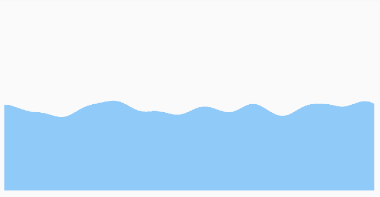
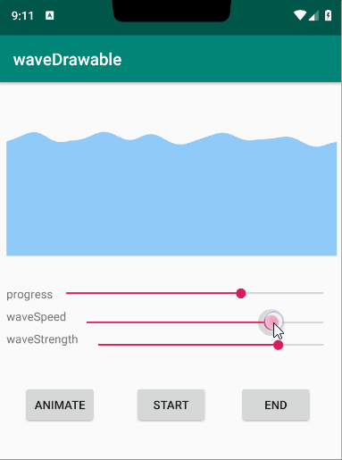
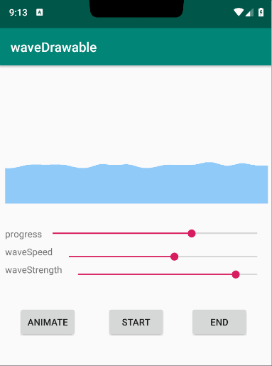

[](https://jitpack.io/#hotstu/WaveDrawable)

# WaveDrawable

extremely real & natural wave-like loading drawable

打造最接近真实自然的水波loading动画

## preview/效果






## how to use/使用
1. Add the JitPack repository to your build file
```
	allprojects {
		repositories {
			...
			maven { url 'https://jitpack.io' }
		}
	}
```
2. Add the dependency
```
	dependencies {
	        implementation 'com.github.hotstu:WaveDrawable:1.0.0'
	}

```
## properties/设置
below is the properties can be configed/支持以下属性

*  direction

the directon the wave expanding, can be one of `TOP LEFT RIGHT BOTTOM`

方向，可以是TOP LEFT RIGHT BOTTOM

*  progress

the expanding progress, in [0, 1]

进度 [0, 1]

*  waveHeight

the height of the wave slop, default is `height * .05f`

设置波峰高度，px,默认为height * .05f

*  waveStrength

the strength of the wave, the larger the more slop in area, default is `0.01f`

设置波浪强度 数值越大单位区域内峰谷越多,默认0.01f

*  waveSpeed

the speed of the wave, the larger the wave change faster, default is `0.05f`

设置波浪速度 数值越大波浪变化越快,默认0.05f


